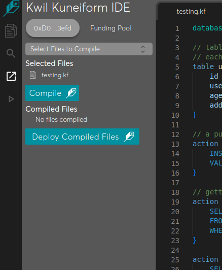

# KWILDB

## Installation
- Download relevent release version from the [link](https://github.com/kwilteam/kwil-cli/releases)
- Extract the downloaded compressed file.
- Set alias pointing to the executable within the extracted folder.
    - `alias kwil-cli=<path-to-executable>/kwil-cli`
- Verify installation:
    - `kwil-cli version`
        - 
- Configure `kwil-cli` using the below mentioned steps:
    - Get `Kwil GRPC URL` from [here](grpc.kwil.com:80)
    - Get `Chain RPC Provider URL` from [Alchemy](https://www.alchemy.com/) or [Quick Node](https://www.quicknode.com/)
    - Steps:
        - Run `kwil-cli configure`.
            - Add `KWIL RPC URL`, `Private Key` and `Chain Provider` details in appropriate arguments.
        - Head over to [KwilDB](https://ide.kwil.com/) ide.
            - Connect your metamask account with ide.
            - Head over to [kwil faucet](https://faucet.kwil.com/).
                - Connect metamask to faucet and get kwil testnet tokens.
            - In ide, create a new workspace.
                - Create folder in workspace, add file `testing.kf.
                  
                - Add the following queries to file `testing.kf`.
                     ```
                        database testing;
                        // table for storing users
                        // each wallet can have a user
                        table users {
                            id int primary notnull,
                            username text notnull unique minlen(5) maxlen(32),
                            age int notnull max(69),
                            address text notnull unique // wallet address
                        }
                        
                        // a public action for creating a user
                        action create_user ($id, $username, $age) public {
                            INSERT INTO users
                            VALUES ($id, $username, $age, @caller);
                        }
                        
                        // getters
                        action get_user_by_username($username) public {
                            SELECT *
                            FROM users
                            WHERE username=$username
                        }
                        
                        action get_user_by_wallet($address) public {
                            SELECT *
                            FROM users
                            WHERE address = $address
                        }
                    ```
                - Head over to compile section in menu.
                    - Select the file to compile and click on compile.
                      
                    - Click on *Deploy Compiled Files* to deploy your database.
        - Head back to local cli.
            - Run the following queries:
                - ```kwil-cli database list --owner=<Add-your-wallet-address-here``` to expect a response similar to image.
                  
                - ```kwil-cli database execute id:<some-int-id> username:<some-name> age:<some-int-age> --action=<action-name> --name=<db-name> --owner=<wallet-address>``` to expect a similar response.
                - 
                - ```kwil-cli database execute username:'<user-name>' --action=<action-name> --name=<db-name> --owner=<wallet-address>``` to expect a similar response.
                  
    
                
